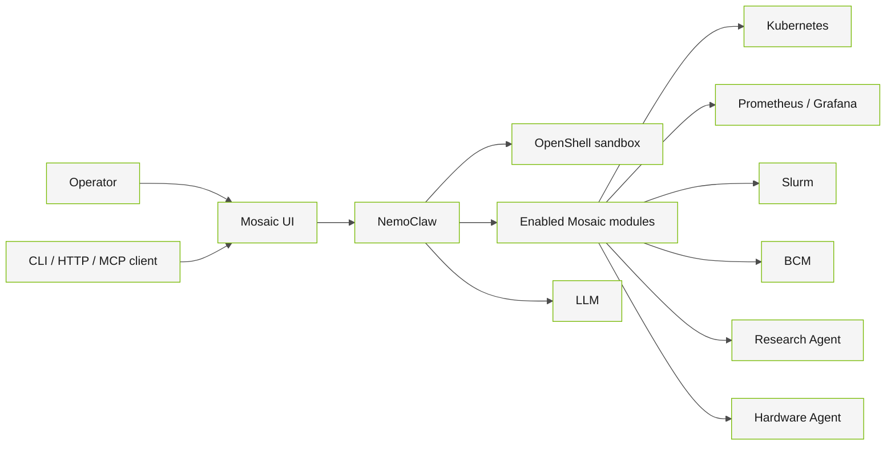

# Mosaic

Mosaic gives AI infrastructure teams a unified operations interface for cluster inspection, observability, and workload root-cause analysis.

# Overview

Mosaic runs NemoClaw and OpenShell on Kubernetes and exposes operational workflows through a unified UI and headless API. Its Helm deployment is modular, allowing operators to connect only the capabilities supported by their environment.

Mosaic supports:

- Read-only Kubernetes workload and cluster inspection.
- Prometheus queries and Grafana dashboard creation.
- Slurm job root-cause analysis from scheduler and log evidence.
- Optional cluster-management integrations.
- Sandboxed command execution with an auditable agent workflow.

# Architecture



OpenShell isolates general agent command execution. Kubernetes, observability, Slurm, and BCM access use module-specific server-side tools and the credentials explicitly configured for those modules. Browser and MCP clients do not receive cluster credentials. Kubernetes Secrets remain mounted only in the pods that require them.

# Requirements

- OS/architecture: a Kubernetes environment compatible with the container images selected in Helm values.
- Runtime: Kubernetes, `kubectl`, and Helm 3.
- LLM: an OpenAI-compatible endpoint or a cluster capable of running chart-managed vLLM.
- GPU/driver: required only when deploying chart-managed vLLM; requirements depend on the selected model profile.
- Optional services: Prometheus, Grafana, Slurm, or cluster-management endpoints for the corresponding modules.

# Getting Started

Use the complete installation guide for your environment:

- [NVIDIA Mission Control installation](docs/nmc_installation.md)
- [Kind installation](docs/kind_installation.md)
- [Custom installation and module configuration](helm/README.md)

# Usage

After installation, forward the Mosaic UI service:

```bash
kubectl -n mosaic port-forward svc/mosaic-ui 3000:3000
```

Open `http://localhost:3000`.

Choose the interface that matches the caller:

| Interface | Intended caller | Contract |
| --- | --- | --- |
| Browser UI | Cluster operators | Interactive chat, dashboards, and enabled operational workflows. |
| HTTP API | Services and scripts | `POST /api/headless/chat` with `prompt` and `sessionKey`; returns the completed assistant turn and run metadata. |
| `mosaic` CLI | Shell and Slurm automation | Sends one prompt to a Mosaic URL and waits for the completed assistant turn. |
| `mosaic-mcp` | Claude Code, Codex, and other MCP clients | Local stdio bridge to the Mosaic HTTP service; exposes chat, history, commands, and enabled module tools. |

The [Mosaic headless skill](docs/skills/mosaic-headless/SKILL.md) gives coding agents the HTTP, CLI, and MCP contracts. Install it for Codex with:

```bash
install -d ~/.codex/skills/mosaic-headless
install -m 0644 docs/skills/mosaic-headless/SKILL.md \
  ~/.codex/skills/mosaic-headless/SKILL.md
```

For Claude Code:

```bash
install -d ~/.claude/skills/mosaic-headless
install -m 0644 docs/skills/mosaic-headless/SKILL.md \
  ~/.claude/skills/mosaic-headless/SKILL.md
```

Invoke the installed skill when an agent needs to discover a Mosaic service, ask an operational question, or configure the MCP bridge.

- More examples and deployment options: [helm/README.md](helm/README.md)
- Use cases: [docs/use_cases.md](docs/use_cases.md)
- Slurm RCA reference: [docs/slurm_rca.md](docs/slurm_rca.md)
- Headless agent integration: [docs/skills/mosaic-headless/SKILL.md](docs/skills/mosaic-headless/SKILL.md)

# Releases & Roadmap

- Release history: [CHANGELOG.md](CHANGELOG.md)
- Planned work is tracked through [GitHub issues](https://github.com/NVIDIA/Mosaic/issues).

# Contribution Guidelines

- Start with [CONTRIBUTING.md](CONTRIBUTING.md).
- Follow the [Code of Conduct](CODE_OF_CONDUCT.md).
- Sign external contributions under the [Developer Certificate of Origin](DCO.md).
- Build and validate the Helm chart as described in the contribution guide.

## Governance & Maintainers

- Governance: [GOVERNANCE.md](GOVERNANCE.md)
- Maintainers: [MAINTAINERS.md](MAINTAINERS.md)
- Repository ownership: [.github/CODEOWNERS](.github/CODEOWNERS)

## Security

- Vulnerability disclosure: [SECURITY.md](SECURITY.md)
- Do not file public issues for security reports.

## Support

- Level: Experimental
- Support policy: [SUPPORT.md](SUPPORT.md)
- Use [GitHub issues](https://github.com/NVIDIA/Mosaic/issues) for non-security problems and feature requests.

# Community

Use GitHub issues and pull requests for project discussions and collaboration. Participation is governed by the project [Code of Conduct](CODE_OF_CONDUCT.md).

# References

- [OpenClaw](https://github.com/openclaw/openclaw)
- [OpenShell](https://github.com/NVIDIA/OpenShell)
- [Helm](https://helm.sh/)
- [Kubernetes](https://kubernetes.io/)

# License

This project is licensed under the [Apache License 2.0](LICENSE).

NVIDIA and third-party attributions and license texts are provided in [NOTICE](NOTICE) and [LICENSE-3rd-party.txt](LICENSE-3rd-party.txt).
