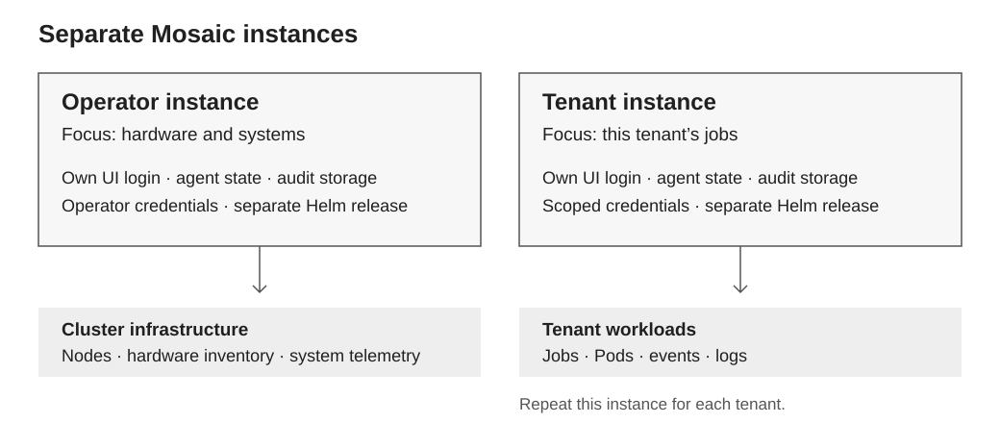

# Tenant and operator deployments

Deploy separate Mosaic instances for operators and tenants. **Operators focus on hardware and systems. Tenants focus on their jobs.** Each instance is a separate Helm release with its own UI login, agent state, audit storage, and credentials.



| Instance | Focus | Example question |
| --- | --- | --- |
| Operator | Cluster health, hardware inventory, networking, and system telemetry | “Which nodes are unhealthy?” |
| Tenant | Its own jobs, Pods, events, and logs | “Why is my job pending?” |

Repeat the tenant instance for each tenant. In an enterprise, these audiences can be the infrastructure team and an application team. Within a tenant VM, visibility is limited to resources exposed to that VM or its scoped APIs.

## Example setup

These Kubernetes examples are read-only. The provider installs both releases and reuses an existing compatible agent-sandbox controller.

- **Tenant:** [tenant-values.yaml](examples/multitenancy/tenant-values.yaml) disables infrastructure integrations and the default cluster reader. Apply [tenant-reader.yaml](examples/multitenancy/tenant-reader.yaml) in workload namespace `tenant-a`, provision a kubeconfig for that identity, and store it as Secret `tenant-a-kubeconfig` (key `config`) in `mosaic-tenant-a`.
- **Operator:** [operator-values.yaml](examples/multitenancy/operator-values.yaml) enables cluster monitoring, observability, and [Base Command Manager](bcm.md). Configure the monitoring URLs, `mosaic-grafana-auth` Secret (`username`, `password`), and `bcm-host-ssh-key` Secret (`id_ecdsa`) for its read-only SSH identity in `mosaic-operator`.

Complete [namespace and registry access setup](installation.md#1-create-the-namespace-and-registry-access) for each release. In each namespace, create a distinct `mosaic-ui-auth` Secret (`username`, `password`, `machineToken`) and `mosaic-inference` Secret (`apiKey`); replace the example inference URL and model with your approved endpoint.

Install with your approved chart version:

```bash
helm upgrade --install mosaic-tenant-a \
  oci://nvcr.io/0948643769302270/afoa-release/mosaic-stack \
  --version "$MOSAIC_CHART_VERSION" --namespace mosaic-tenant-a \
  -f tenant-values.yaml --atomic --wait --timeout 12m

helm upgrade --install mosaic-operator \
  oci://nvcr.io/0948643769302270/afoa-release/mosaic-stack \
  --version "$MOSAIC_CHART_VERSION" --namespace mosaic-operator \
  -f operator-values.yaml --atomic --wait --timeout 12m
```

## Access boundaries

Backend credentials and Kubernetes RBAC enforce access. **The chart's default Kubernetes reader is cluster-wide**, even when installed in a tenant namespace; keep it disabled for tenants. Before handover, verify with the tenant kubeconfig that job and log reads work in `tenant-a`, while other namespaces, nodes, Secrets, and job mutations are denied.

Give each audience its own UI address and login. Enforce network isolation with authenticated ingress and provider-managed network policies; namespace separation alone is insufficient. Keep storage and credentials separate, including any added MCP or metrics backend. These are separate deployments, not per-user authorization in a shared UI. Cluster administrators and the runtime controller remain trusted; use separately administered clusters or VMs when required for mutually untrusted tenants.
